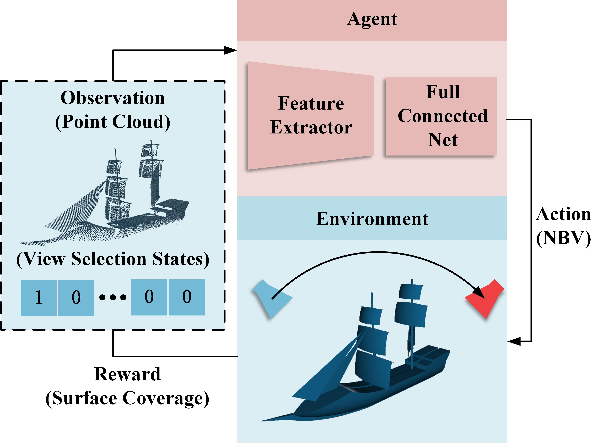
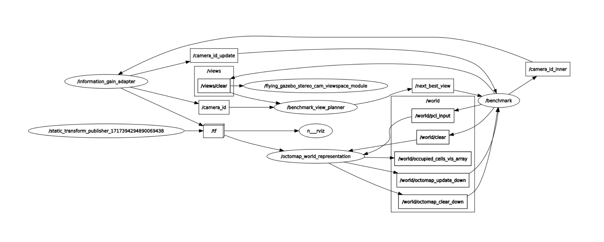

# **RL-NBV**
This repository hosts the implementation of RL-NBV which is a deep reinforcement learning based Next-Best-View method for unknown object reconstruction.
<p>    

</p>

## Training Data
The training data contains the complete point cloud of the model and partial point clouds captured in candidate views.

1.The complete point cloud is generated using the tool in the `./tools/sample/` directory.
```
./tools/sample/run.sh
```

2.Partial point clouds are generated using the tool in the `./tools/render/` directory
```
blender -b -P generate_render_exr.py
python generate_render_pcd.py --data_path [data path]\
                              --output_path [output path]\
```

3.We provide two testing datasets, **complex shaped object dataset** and **mechanical components dataset** in the `./data` directory.
## Train
```
./run_train.sh
```
## Test
### 1. RL-NBV
```
# set test_rlnbv to 1
./run_benchmark.sh
```
### 2. PC-NBV
To validate PC-NBV on the same test datasets, we modified the original PC-NBV code. The modified code is available at the [repository](https://github.com/MingFengHill/PC-NBV). The commands to run the test is as follows:
```
python benchmark_pcnbv.py
```
### 3. Area Factor / Proximity Count
The original [implementation](https://github.com/uzh-rpg/rpg_ig_active_reconstruction) required importing models into Gazebo for simulation. To improve the efficiency of validation, we used ROS to publish pre-generated partial point clouds, thereby avoiding the use of Gazebo. The modified code is available at the [repository](https://github.com/MingFengHill/rpg_ig_active_reconstruction/tree/kinetic). Validation requires running the following commands in different terminals:
```
# Terminal 1:
roslaunch flying_gazebo_stereo_cam rviz.launch
# Terminal 2:
roslaunch flying_gazebo_stereo_cam view_space.launch
# Terminal 3:
roslaunch ig_active_reconstruction_octomap octomap_world_representation.launch
# Terminal 4:
roslaunch ig_active_reconstruction_ros benchmark_view_planner.launch
# Terminal 5: use python 2.x
python ig_proxy.py
# Terminal 6: set test_information_gain to 1
./run_benchmark.sh
```
Then, press **'g'** in Terminal 4 to start the validation process. The models in the preset test dataset will be tested sequentially, with the following results:
<p>    

</p>
The nodes and topics of ROS are as follows:
<p>    

</p>

## Acknowledgment
This work was inspired by the following project:

[PC-NBV](https://github.com/Smile2020/PC-NBV)

[rpg_ig_active_reconstruction](https://github.com/uzh-rpg/rpg_ig_active_reconstruction)

[PointNet++ implementation](https://github.com/yanx27/Pointnet_Pointnet2_pytorch)

[gym](https://github.com/openai/gym)

[stable-baselines3](https://github.com/DLR-RM/stable-baselines3)

